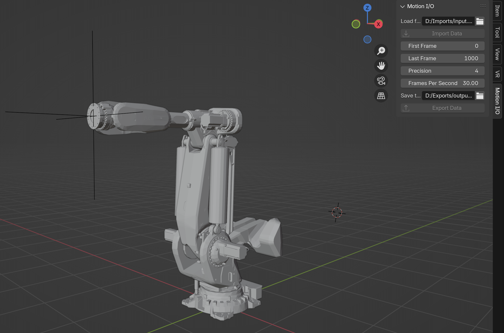

## blender_robot_anim_tools
 Collection of Models, Scripts, Rigs, and Animations designed to be used in Blender

*Fig 1: Screenshot of the robot control interface*

How to install the Blender Add-on (Tested in Blender 4.2) 
---------------------------------------------------------
- Go to Edit -> Preferences -> Add-Ons 
- In the Add-On Panel Select the dropdown in the upper right hand corner of the panel. Select "Install from Disk..."
- Navigate to the location of this repository on disk.
- Select "motion_data_io.py" from the Scripts folder
- You will now see a new Panel labeled "Motion Data I/O

How to use the Blender Add-on
-----------------------------
To Import Animation 
- Select the location of the csv containing the animation data you wish to import
- Once a valid file path is provided, the button is enabled. 

To Export Animation
- Select the location you want to save the csv containing the animation data.
- Once a valid file path is provided, the button is enabled.
- In your scene select the track curve. (Ensure the scene is set to Object Mode)
- Now you can execute the export by pressing the button.
- The .csv file should appear in your chosen directory. 

To use a simplified version of the script with no user interface...
-------------------------------------------------------------------
- In Blender, go to the Scripting Tab. 
- Select Open Text
- Navigate to the location of this repository on disk.
- Select "export_motion_data.py" from the Scripts folder
- Manually adjust the curve, csv save location, start_frame and end_frame
- The .csv file should appear in your chosen directory. 

-------------------------------------------------------------------
- Reach out if you have questions. @camkania on socials
